# CIRCULA — Circular Economy Marketplace

> **Waste is a resource waiting for a match.**

CIRCULA is a hackathon MVP for **SD-04 – Circular Economy Marketplace** under the **Sustainable Development** theme. It helps organizations discover, list, exchange, and measure the impact of reusable industrial materials.

[View Presentation](SD-04 - Circular Economy Marketplace__CIRCULA.pdf)

## Problem statement

Large quantities of reusable industrial waste remain unused because organizations lack a trusted, searchable exchange ecosystem. Valuable materials are often sent to disposal instead of being matched with another organization that can reuse them.

## Proposed solution

CIRCULA brings surplus industrial materials into one marketplace. Organizations can explore verified-looking listings, review a material’s carbon-saving estimate and ownership history, submit an exchange request, and track sustainability metrics through a focused dashboard.

## Key features

- Interactive marketplace with seeded industrial materials
- Search, category and location filtering, plus sorting by recency, carbon impact, or value
- Material detail view with quantity, condition, location, seller, estimated carbon savings, and reuse applications
- Demo request and wishlist interactions with confirmation feedback
- AI-assisted material classification demo with loading feedback and reuse recommendations
- Carbon impact dashboard with charts and an estimate-based calculator
- Simulated, blockchain-ready ownership timeline/material passport
- Material listing form with browser validation and success feedback
- Demo sign-in, sign-up, and password-reset user flows
- Responsive UI for mobile, tablet, and desktop

## How the system works

1. A supplier lists a surplus industrial material with its quantity, condition, location, and expected value.
2. Buyers search or filter the marketplace to find a relevant reusable resource.
3. The buyer opens the material passport to review its details, carbon estimate, and ownership timeline.
4. The buyer submits a material request and receives immediate feedback.
5. The organization dashboard visualizes estimated waste diversion and carbon impact.

The current submission uses local in-memory demo data and UI state so the complete journey can be demonstrated without external services.

## AI-assisted material classification

The **AI Classifier** offers an image-selection/description interface and a realistic analysis state before showing a predicted material, confidence score, reuse pathways, and estimated carbon-saving potential.

> **Demo note:** The current result is a clearly labelled simulated/mock model output. It does not call a computer-vision or machine-learning API. The interface is designed so a real vision service can be connected later.

## Marketplace functionality

The marketplace starts with eight seeded material listings, including recycled steel, aluminium scrap, fly ash, reclaimed wood, HDPE regrind, copper offcuts, glass cullet, and textile offcuts.

Available interactions:

- Free-text search by material, category, or location
- Category and location filters
- Sorting by recency, estimated carbon impact, or expected value
- Favourites/wishlist toggle
- Material detail navigation
- Request confirmation
- Empty state with filter reset

## Carbon impact analytics

The organization impact dashboard provides:

- Waste-diverted, CO₂e-avoided, recaptured-value, and reuse-rate summary cards
- Monthly estimated carbon-avoidance trend chart
- Category-wise impact chart
- Interactive calculator for material type, quantity, and reuse distance

> All carbon values are **estimates for demonstration purposes**, not verified lifecycle assessments or emissions credits.

## Ownership tracking / material passport

Each material detail view includes an ownership timeline with listing, classification, availability, verification context, and a reference hash.

> **Demo note:** This is a simulated immutable-ledger record and a blockchain-ready UI abstraction. No blockchain transaction or on-chain verification occurs in the current codebase.

## Organization dashboard

The dashboard presents an example organization’s sustainability performance with interactive Recharts visualizations and a carbon impact calculator. It is populated with demo data to keep the judge-facing flow immediate and understandable.

## Technology stack

- **Framework:** Next.js 16, React 19, TypeScript
- **Styling:** Tailwind CSS 4 and custom CSS
- **Charts:** Recharts
- **Icons:** Lucide React
- **Notifications:** Sonner
- **AI:** AI-assisted material classification demo (simulated/mock model output)
- **Blockchain:** Blockchain-ready ownership/material passport abstraction (simulated in the current MVP)
- **Quality Checks:** ESLint and TypeScript

## Architecture overview

```text
app/
├── layout.tsx       # Root HTML layout and metadata
├── page.tsx         # Client-side MVP views, demo data, and interactions
└── globals.css      # Responsive visual system and animations

eslint.config.mjs    # Next.js Core Web Vitals lint configuration
next.config.mjs      # Next.js/Turbopack configuration
```

The MVP is intentionally compact: seeded material data and temporary UI state live in `app/page.tsx`. This makes the hackathon flow easy to explain. A production version would move these concerns to typed domain models, API routes/services, authentication, storage, and external AI/ledger providers.

## Installation and local setup

### Prerequisites

- Node.js 20+ recommended
- npm

### Run locally

```bash
git clone <your-repository-url>
cd circula-circular-economy-marketplace
npm install
npm run dev
```

Open [http://localhost:3000](http://localhost:3000).

### Quality and production commands

```bash
npm run lint
npx tsc --noEmit --incremental false
npm run build
npm start
```

## Environment variables

The current demo does **not** require environment variables or API keys.

When integrating production services, create a local `.env.local` file (which is ignored by Git) and document safe variable names in an `.env.local.example` file. Never commit secrets, access tokens, private keys, or production credentials.

Example future-only variable names:

```bash
# Do not add real values to version control.
NEXT_PUBLIC_APP_URL=http://localhost:3000
AI_CLASSIFIER_API_URL=
LEDGER_API_URL=
```

## Live demo

[Open CIRCULA Live Demo]
(https://circula-circular-economy-marketplac-tau.vercel.app/)

1. Explore the landing page and sustainability metrics.
2. Open **Marketplace**, search/filter a material, and view its details.
3. Review the ownership timeline and submit a material request.
4. Open **AI Classifier** and run the explicitly labelled demo analysis.
5. Open **Impact** to demonstrate analytics and the carbon calculator.
6. Submit a material through **List material**.

## GitHub repository

[View CIRCULA Source]
```text
https://github.com/shreyasingh0122/circula-circular-economy-marketplace.git
```

## Screenshots

### Authentication
   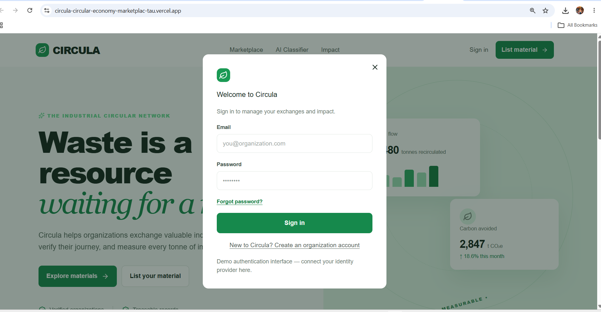
### Landing page 
   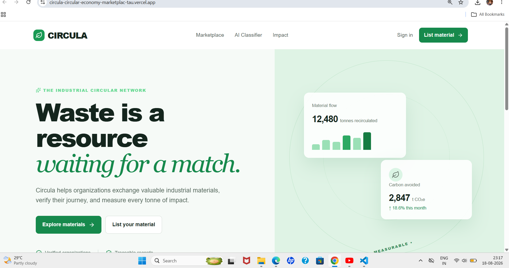
   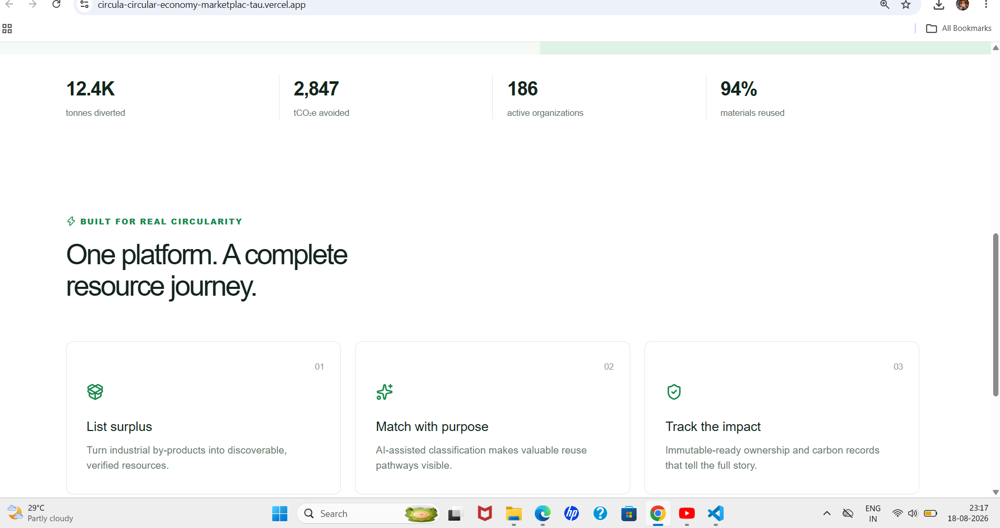
   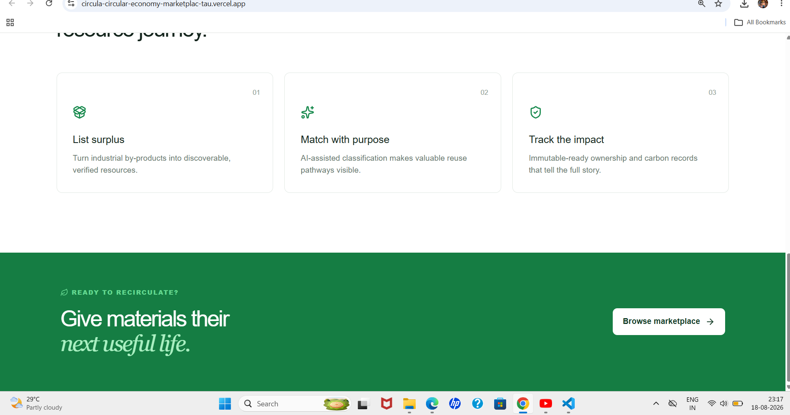
### Marketplace search/filter state
   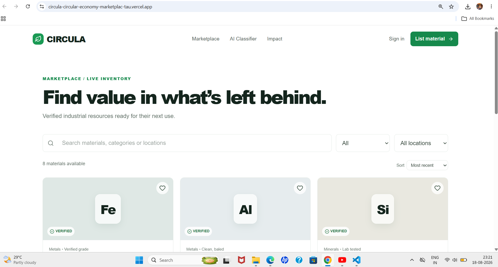
   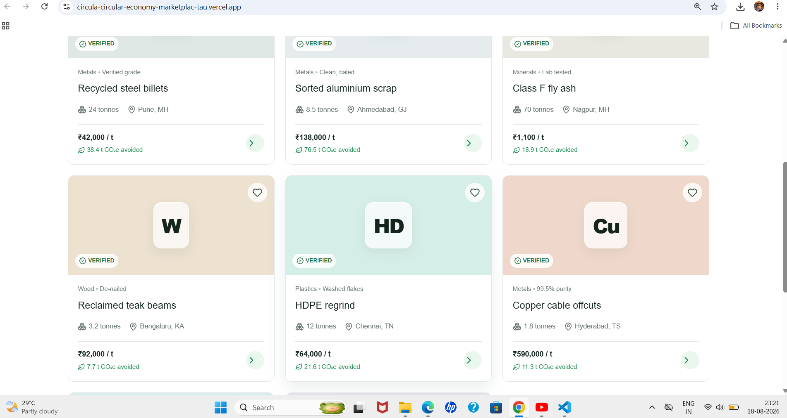
### AI-assisted classification demo result
   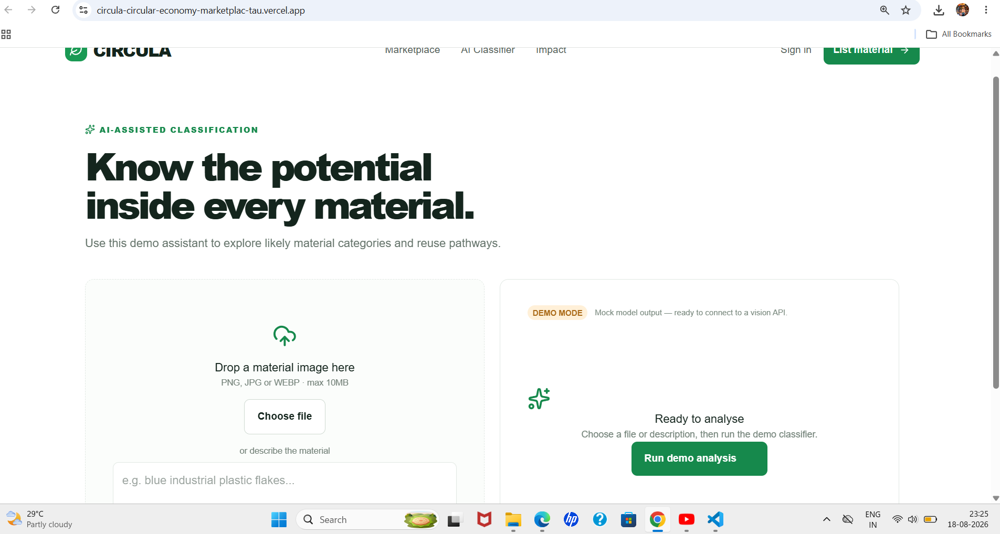
### Carbon impact dashboard and calculator
   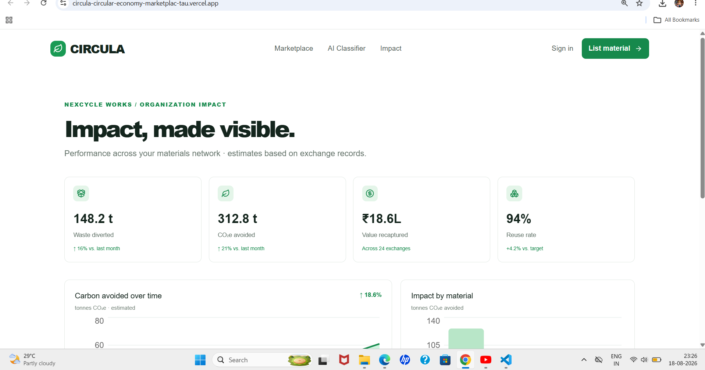
   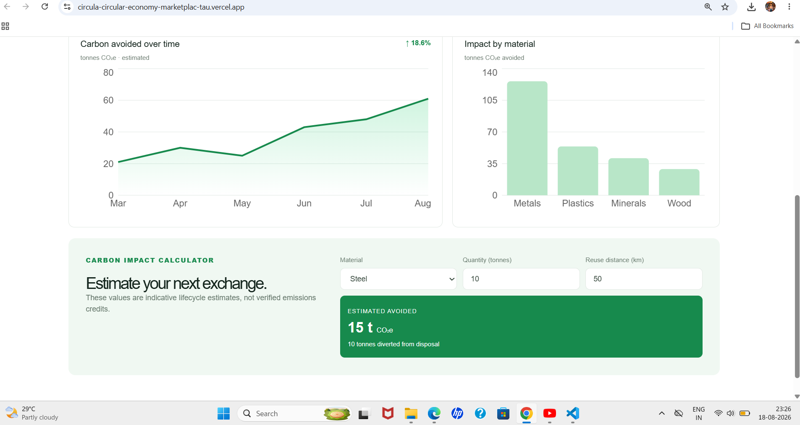
### Material listing form
   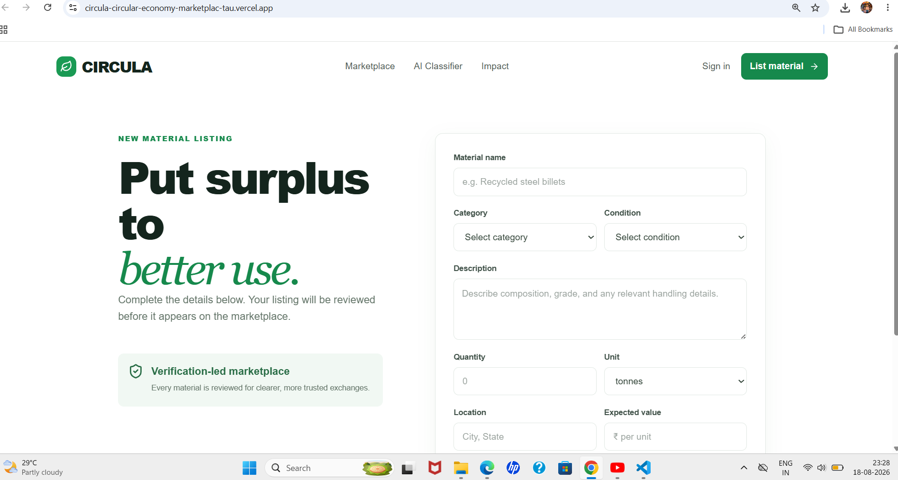
   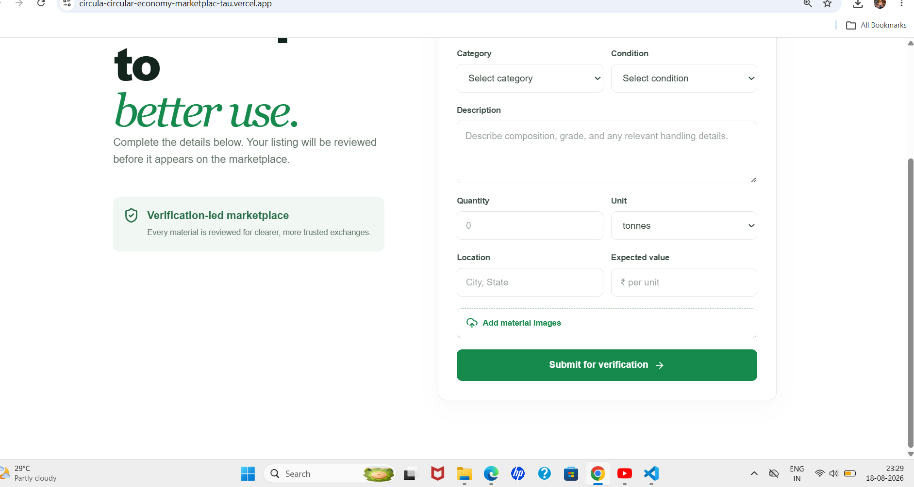

## Future scope

- Connect authenticated organization accounts and role-based access
- Persist listings, requests, and organization profiles in a database
- Integrate a real computer-vision/material-classification API
- Use verified lifecycle assessment data for carbon estimates
- Add file storage and material-image moderation
- Connect a production ledger or blockchain network for auditable ownership events
- Add notifications, messaging, and exchange-status workflows

## Team
| Name | Role |
|---|---|
| Shreya Singh | Product and Strategy |
| Nandani Jaiswal | AI and Backend Development |
| Priyanka Gupta | UI/UX Design |
| Aaliya Fatima | Research, Documentation and Frontend |

## Presentation

[View Presentation](SD-04 - Circular Economy Marketplace__CIRCULA.pdf)
